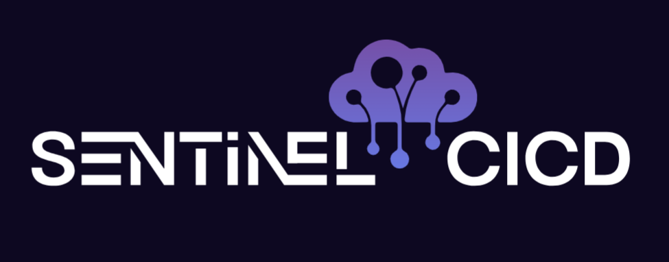
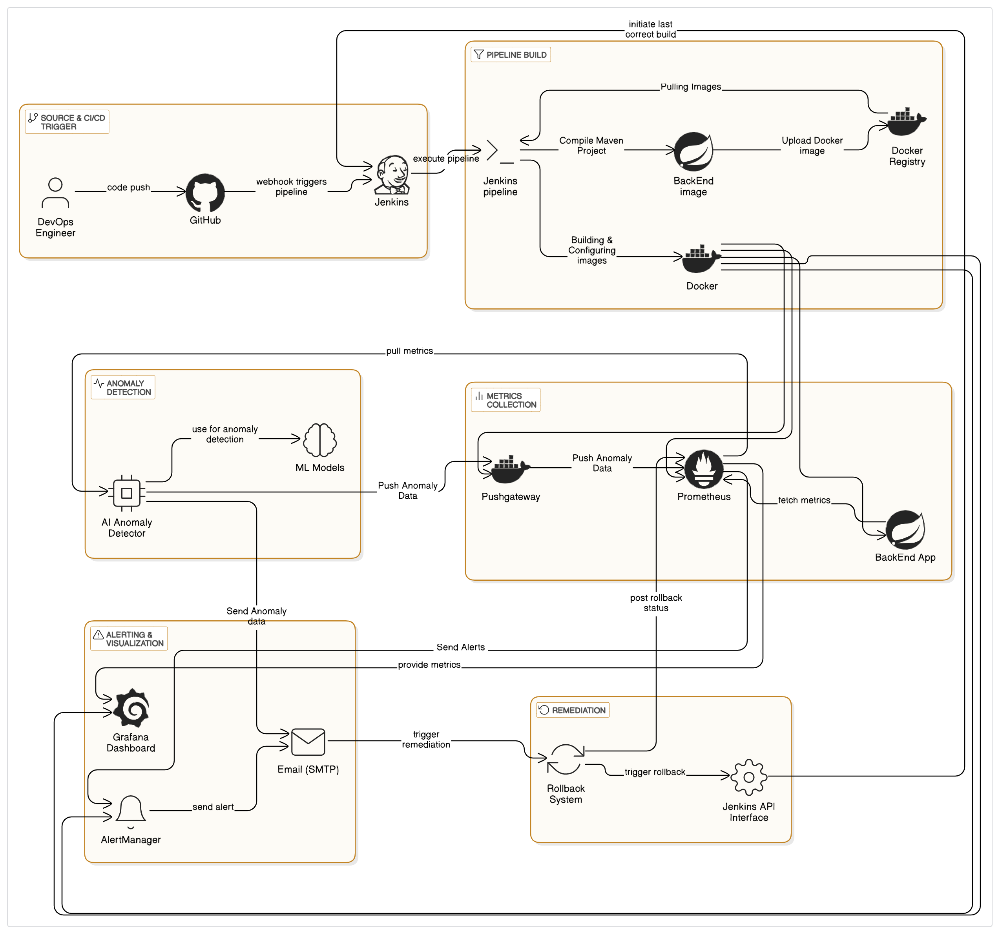

# SentinelCICD

<p align="center">
    <a href="https://github.com/YoussefDhb/SentinelCICD">
        
    </a>
</p>

A proactive, ML-driven CI/CD monitoring and remediation framework designed to detect, alert, and rollback pipeline anomalies before they escalate.

---

## Table of Contents
- [Project Overview](#project-overview)
  - [Key Layers](#key-layers)
  - [Key Components](#key-components)
- [Folder Structure](#folder-structure)
- [General Application Features](#general-application-features)
- [Prerequisites](#prerequisites)
- [Getting Started](#getting-started)
- [Contributing](#contributing)
- [License](#license)
- [References & Resources](#references--resources)

---

## Project Overview

SentinelCICD is built around a layered architecture that ensures real-time insight into pipeline health and recovery from emerging issues.

<p align="center">
    
</p>

### Key Layers
- **Source & CI/CD Trigger:** Developers push code to GitHub; Jenkins pipeline is triggered via webhooks.
- **Metrics Collection:** A Spring Boot containerized backend and Jenkins jobs expose metrics, which are collected by Prometheus in Docker containers hosted on Azure.
- **Anomaly Detection:** A Python-based service that regularly pulls Prometheus metrics and applies three machine-learning models (LSTM, Prophet, Isolation Forest) to identify abnormal patterns early.
- **Alerting & Visualization:** A system that routes notifications via email or webhooks, based on the results provided by AlertManager or Anomaly Detection. Grafana dashboards visualize real-time and historical metrics for pipeline health.
- **Remediation:** Upon receiving a validated alert, the Rollback System provides the chance to fail-back procedures, by communicating with the Jenkins API to initiate the last known good build.

### Key Components
- **SpringApp:** The core Backend Spring Boot service exposing custom metrics, containerized via Docker.
- **Pushgateway:** Receives and exposes transient metrics from short-lived jobs.
- **Prometheus:** Centralized time-series database that scrapes metrics and evaluates alert rules.
- **Anomaly Detector:** Containerized Python service applying ML models to periodically check anomalous behavior on Prometheus data.
- **Alerting System:** Manages and routes alerts to Email or Dashboard.
- **Rollback System:** Flask-based service that initiates remediation via Jenkins API when anomalies are confirmed.
- **Grafana:** Visualization tool for real-time metrics and anomaly scores.

---

## Folder Structure

```text
├── frontend/
├── backend/
│   ├── src/
│   │   └── main/
│   │       ├── java/                # Spring Boot application code (metrics endpoints, controllers)
│   │       └── resources/           # application.properties
│   └── Dockerfile                   # Builds the Spring Boot service into a Docker image
│
├── monitoring/
│   ├── prometheus.yml               # Prometheus scrape and alert configurations
│   ├── alertmanager.yml             # Alertmanager routing and receiver configurations
│   └── alert.rules.yml              # Setting the Alerting rules
│
├── VM_Setup/
│   ├── AnomalyDetection.py          # fetches metrics & runs ML-based anomaly detection
│   ├── anomaly_plots/               # Sample plots illustrating detected anomalies
│   ├── rollback/ 
│   │   └── app.py                       # Flask web service for rollback control
│   │   └── templates/                   # templates for rollback UI (login, history, approval)
├── docker-compose.yml               # Orchestrates all services: mysql, springboot, prometheus, alertmanager, grafana, pushgateway.
```

---

## General Application Features

- **Multi-Model Anomaly Detection**
  - Implements three complementary models:
    - LSTM for sequential pattern analysis.
    - Prophet for trend and seasonality modeling.
    - Isolation Forest for statistical outlier detection.
  - Periodically analyses metrics and detects sudden spikes, trend deviations, and statistical outliers and flags anomalous behavior.

- **Proactive Alerting**
  - Alerts fire at the earliest sign of abnormal behavior.
  - Grafana dashboards display real-time and historical anomaly metrics.
  - Sends detailed notifications via email or webhook.

- **Rollback & Recovery**
  - Upon anomaly validation, rollback service triggers a fail-back to the last stable release.
  - Includes a history log for each rollback event.
  - Supports role-based approvals.

- **End-to-End Containerization**
  - All microservices and tools run as Docker containers on Azure Cloud.
  - Simplifies deployment and scaling.

---

## Prerequisites

- Docker (v20.10+ recommended)
- Docker Compose (v1.29+)
- Java Development Kit (JDK 11 or higher)
- Python (v3.8+)
- Git (for cloning repository)

**Optional:**
- Azure CLI (for deploying containers to Azure)

---

## Getting Started

1. **Clone the Repository**
2. **Configure Jenkins, Prometheus, Grafana and AlertManager, along with Environment Variables.**
3. **Build & Deploy all services**
    1. Build the Spring Boot Backend Docker image.
    2. Run Jenkins to handle CI/CD triggers.
    3. Spin up Prometheus, Alertmanager, and Grafana.
    4. Launch the Anomaly Detection service, along with Rollback configurations.
4. **Verify Deployment & Testing**

---

## Contributing

We welcome contributions to enhance SentinelCICD’s monitoring, detection, and remediation capabilities. To contribute:

1. Fork this repository.
2. Create a new branch:

   ```bash
   git checkout -b feature/<your-feature-name>
   ```

3. Implement your feature or fix.
4. Commit with a clear, descriptive message.
5. Push to your fork and open a Pull Request.

---

## License

This project is licensed under the MIT License. See the LICENSE file for details.

---

## References & Resources

You can use these resources to extend, customize, and troubleshoot your deployment:

- [Jenkins Documentation](https://www.jenkins.io/doc/book/)
- [Prometheus Documentation](https://prometheus.io/docs/)
- [Grafana Documentation](https://grafana.com/docs/)
- [Alertmanager Documentation](https://prometheus.io/docs/alerting/latest/alertmanager/)
- [Spring Boot Documentation](https://spring.io/projects/spring-boot)
- [Docker Documentation](https://docs.docker.com/guides/)
- [Flask Documentation](https://flask.palletsprojects.com/)

